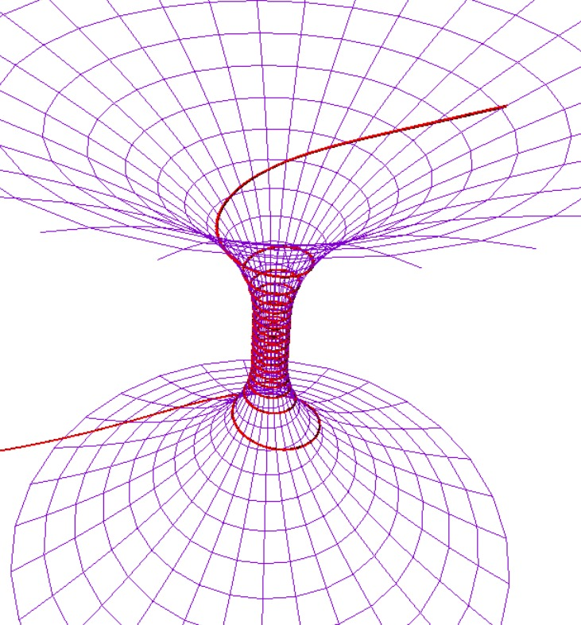
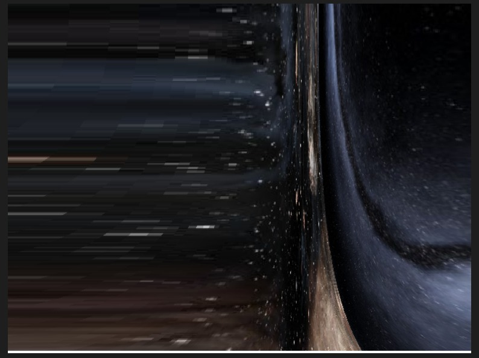
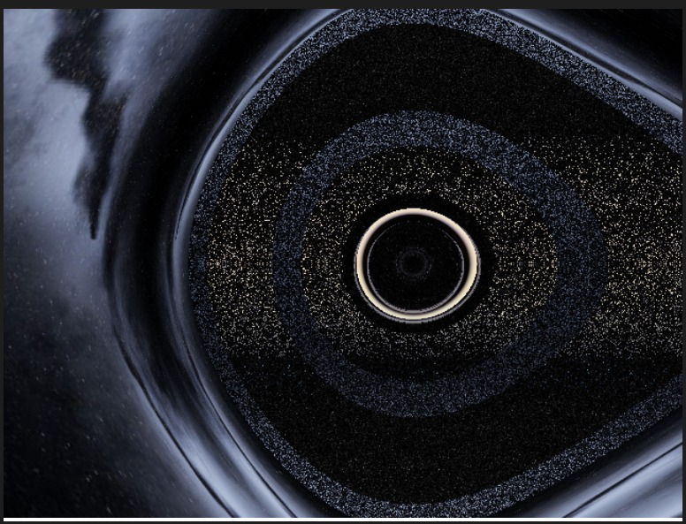

# GR-Wormholes

Inspired by the paper [Visualizing Interstellar's Wormhole](https://arxiv.org/abs/1502.03809v3) I've made python code capable of generating wormhole visualizations. 

## Images

Metric with integrated light path

Observer at the edge of the wormhole

Observer looking straight at it, with 'noise' due to integration errors. 

## Optimizations

There's also code made in C++, CUDA, where I've implemented the DOPRI5 ODE solver algorithm in a CUDA kernel in order to view the wormhole interactively in run time. Currently is in test phase. 
